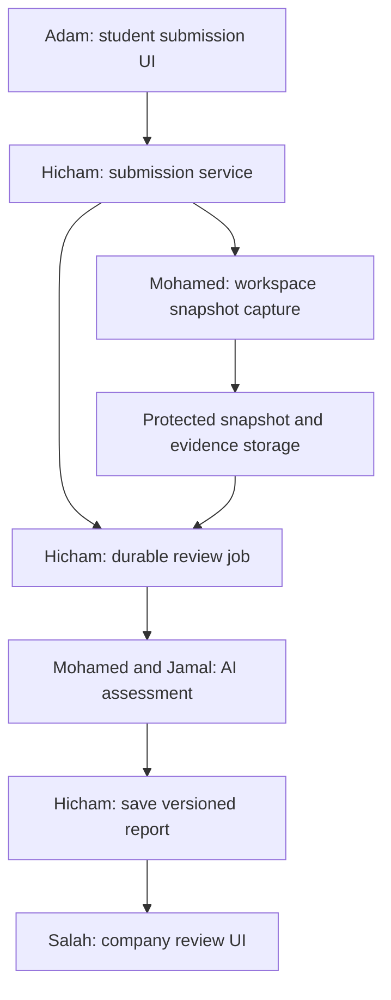

# Repository Structure and Developer Collaboration

**Project:** ft_transcendence — interview preparation and company labs  
**Date:** 26 September 2026  
**Audience:** Mohamed, Jamal, Adam, Salah, Hicham  
**Status:** proposed repository organization for team agreement. Responsibilities reflect the current decisions; framework-specific files and infrastructure choices remain to be finalized.

This README explains where to write code, who coordinates each part, how shared features connect, and how to avoid duplicate implementations and conflicting changes.

This is a repository structure guide, not an existing runnable application or the complete final 42 submission README. No application scaffolding is created by this document. Once adopted, keep it at `docs/development/repository-structure.md` and link it from the project's root README, or incorporate it into that README. The final submission README must also include the subject's required introduction with actual 42 logins, setup instructions, features, module calculations, and contributions.

## 1. Core organization rule

Use **one shared repository** organized by application and feature. This proposal is a monorepo: related applications and documentation live in one repository.

- `apps/web/`: browser interfaces.
- `apps/api/`: trusted application backend and business rules.
- `apps/workspace-service/`: restricted service controlling student workspaces.
- `packages/contracts/`: shared API and event definitions.
- `infra/`: deployment configuration, environment templates, monitoring, and operational scripts.
- `docs/`: product decisions, architecture, setup, and operations documentation.

Do not create `fullstack1/`, `fullstack2/`, or folders named after teammates. Adam and Salah both work across `web/` and their feature modules in `api/`. Hicham owns shared workflows, not every backend file.

A folder is not automatically a container or microservice. In this proposal, backend modules share one application. The review worker can be a separate process using the same backend code/image. Student code executes outside that trusted application.

## 2. Team roles

| Member | Confirmed roles | Main responsibility |
|---|---|---|
| Mohamed | Product Owner, DevOps developer, AI partner | Priorities, acceptance criteria, environments, workspace infrastructure, deployment, monitoring, AI with Jamal |
| Jamal | Technical Lead, Security developer, AI partner | Architecture, shared identity/permissions, security, AI with Mohamed |
| Adam | Project Manager, Fullstack 1 | Student experience and relevant APIs; delivery coordination and blockers |
| Salah | Fullstack 2 | Company experience, public home, organization/opportunity/lab APIs, full hiring analytics |
| Hicham | Backend developer | Shared data coordination, submissions, human reviews, invitations, notifications, messaging, review-job orchestration |

Ownership means coordinating a deliverable; it does not forbid other contributors. Every implementation card has one primary owner and a reviewer. Account for PO, PM, Technical Lead, and AI collaboration when estimating workload.

## 3. Proposed full repository map

This is the target map, not a requirement to create every empty directory now. Framework routing names and file extensions must be adapted after stack selection. Application templates below are examples of responsibility boundaries, not a confirmed language choice.

```text
ft_transcendence/
├── apps/
│   ├── web/
│   │   ├── src/
│   │   │   ├── app/                     # Router, providers, top-level layouts
│   │   │   ├── features/
│   │   │   │   ├── public/              # Home and public information
│   │   │   │   ├── auth/                # Shared identity UI and role entry flows
│   │   │   │   ├── student/             # Student profile and dashboard
│   │   │   │   ├── company/             # Company profile, dashboard, recruiters
│   │   │   │   ├── opportunities/       # Discovery and company management views
│   │   │   │   ├── labs/                # Instructions, company editor, AI draft UI
│   │   │   │   ├── workspace/           # Editor, terminal, save and connection state
│   │   │   │   ├── submissions/         # Submit, versions, candidate review views
│   │   │   │   ├── invitations/         # Student/company invitation views
│   │   │   │   ├── preparation/         # Guide, interview/practice UI, progress
│   │   │   │   ├── chat/                # Shared conversation UI and role views
│   │   │   │   ├── notifications/       # Notification presentation
│   │   │   │   ├── analytics/           # Company hiring charts and filters
│   │   │   │   └── admin/               # Verification, users, reported content
│   │   │   ├── components/              # Generic buttons, fields, dialogs, layouts
│   │   │   ├── lib/                     # Shared API client and browser utilities
│   │   │   └── styles/                  # Theme, design tokens, global styles
│   │   ├── public/                      # Static public assets; never private uploads
│   │   └── tests/                       # Web integration checks
│   │
│   ├── api/
│   │   ├── src/
│   │   │   ├── bootstrap/              # HTTP server and route registration
│   │   │   ├── entrypoints/            # API and background-worker startup
│   │   │   ├── modules/
│   │   │   │   ├── auth/
│   │   │   │   ├── students/
│   │   │   │   ├── companies/
│   │   │   │   ├── opportunities/
│   │   │   │   ├── labs/
│   │   │   │   ├── workspaces/
│   │   │   │   ├── submissions/
│   │   │   │   ├── reviews/            # Human company review workflow
│   │   │   │   ├── invitations/
│   │   │   │   ├── notifications/
│   │   │   │   ├── preparation/
│   │   │   │   ├── chat/
│   │   │   │   ├── analytics/
│   │   │   │   ├── files/
│   │   │   │   ├── admin/
│   │   │   │   └── ai/                 # Generation and evidence-based review
│   │   │   ├── common/                 # Shared errors, request identity, logging
│   │   │   │   └── authorization/      # Reusable access primitives
│   │   │   ├── config/                 # Read and validate runtime configuration
│   │   │   ├── integrations/           # Storage and workspace-service clients
│   │   │   └── database/
│   │   │       ├── schema/             # ORM-specific models/schema
│   │   │       ├── migrations/         # Ordered database changes
│   │   │       └── seeds/              # Synthetic development fixtures
│   │   └── tests/                      # API integration checks
│   │
│   └── workspace-service/
│       ├── src/
│       │   ├── sessions/               # Runtime lifecycle and active connections
│       │   ├── files/                  # Authorized project file access
│       │   ├── terminal/               # Terminal connection to the student shell
│       │   ├── capture/                # Snapshot/run capture; no custom grader
│       │   ├── runtime/                # Adapter to chosen isolation technology
│       │   └── config/
│       └── tests/
│
├── packages/
│   └── contracts/
│       ├── http/                       # Request/response definitions
│       ├── events/                     # Chat, status, notification event shapes
│       ├── schemas/                    # Shared public validation schemas
│       └── examples/                   # Synthetic requests and responses
│
├── infra/
│   ├── docker/                         # Trusted application build files
│   ├── proxy/                          # Routing, TLS, streaming/connection settings
│   ├── workspace-templates/
│   │   └── template-v1/                # Add only when first runtime is selected
│   │       ├── README.md               # Capabilities and unsupported operations
│   │       ├── manifest.json           # Template version and supported actions
│   │       └── starter/                # Files copied into a student's workspace
│   ├── monitoring/                     # Prometheus, exporters, Grafana, alerts
│   ├── logging/                        # ELK collection/indexing/retention config
│   ├── deployment/                     # Chosen deployment definitions
│   └── scripts/                        # Backup, restore, release, cleanup helpers
│
├── tests/
│   └── e2e/                            # Cross-application user journeys
├── docs/
│   ├── product/                        # Feature map, roles, acceptance, scope
│   ├── architecture/                   # Diagrams and decision records
│   ├── development/                    # Setup, repository guide, contribution rules
│   └── operations/                     # Deployment, incidents, recovery instructions
├── .github/
│   ├── workflows/                      # CI/CD jobs
│   └── pull_request_template.md
├── compose.yaml                        # Proposed local environment entry point
├── .env.example                        # Variable names and harmless examples
├── .gitignore
└── README.md                           # Project overview and working setup entry point
```

Dependency manifests and lockfiles depend on the chosen stack and package manager. Add them once decided; do not create competing npm/yarn/pnpm lockfiles. This guide intentionally does not claim an install/build command already works.

## 4. Where each developer writes code

| Developer | Frontend | Backend / service | Infrastructure / documentation |
|---|---|---|---|
| Adam | Student/profile/dashboard; discovery; workspace; submit; preparation; student chat/invitations | `students/`, `preparation/`, opportunity discovery endpoints | Student acceptance flows; PM coordination records |
| Salah | Public home; company/profile/team; opportunity/lab editor; company review/report/chat; analytics | `companies/`, opportunity management, `labs/`, `analytics/` | Company journeys and API documentation |
| Hicham | Integration support | `submissions/`, `reviews/`, `invitations/`, `notifications/`, `chat/`, application-side `workspaces/`, worker scheduling and evidence metadata | Shared relationships and interface contracts |
| Jamal | Admin; shared auth UI coordination with Adam/Salah | `auth/`, `admin/`, `files/`, shared authorization; `ai/` with Mohamed | Technical decisions and security checks |
| Mohamed | AI/workspace integration support | `ai/` with Jamal; workspace-service lifecycle/runtime/capture | `infra/`, Compose, CI/CD, operations, PO acceptance |

### Shared-folder rules

- `web/features/auth/`: Adam owns student entry forms; Salah company entry forms; shared recovery/auth widgets have one card owner. Jamal owns backend identity behavior.
- `opportunities/`: Adam owns discovery/search; Salah owns create/edit/publish/close. Agree files, contract, and routes before starting.
- `web/features/chat/`: share message rendering and connection utilities. Adam owns the student inbox; Salah owns the company inbox. Hicham owns the messaging API and event contract.
- `web/features/submissions/`: Adam owns submit/status; Salah owns recruiter review/report UI. Hicham owns version/lifecycle rules.
- `api/modules/ai/`: Mohamed and Jamal split individual cards; do not both independently implement a provider client or prompt system.

Reviewer suggestions are planning guidance, not implemented GitHub permission rules.

## 5. How a frontend feature is organized

An illustrative feature folder:

```text
features/submissions/
  student/             # Submit, explanation, revision, status screens
  company/             # Code, evidence, AI report, human review screens
  components/          # Reused submission-specific display elements
  api/                 # Calls to the agreed backend endpoints
  tests/               # Meaningful behavior checks
```

Keep only directories the feature actually needs. A small profile page does not need five empty abstraction layers.

- A generic button belongs in `src/components/`.
- A submission-version selector belongs in this feature.
- API authentication/error transport belongs in `src/lib/`.
- A request to submit a solution belongs in the feature's `api/`.
- Database access and provider keys never belong in browser code.

`src/app/` means the framework's routing/composition boundary. If the chosen framework uses another convention, follow it consistently. Route files should compose features rather than contain all their implementation.

## 6. How a backend module is organized

Conceptual structure; `.ts`, `.py`, or framework-specific names remain to be chosen:

```text
modules/submissions/
  routes               # Register endpoints
  controller           # Parse request; call service; return response
  schema               # Validate accepted payloads
  service              # Submission rules and orchestration
  repository           # Database reads and writes
  jobs                 # Durable review-job handlers
  tests                # Deadline, versioning, retry, access behavior
```

Example: when a student submits, the controller calls the service. The service checks access/deadline, coordinates a consistent snapshot, persists metadata, and schedules AI review. The repository executes database operations; it does not decide the hiring outcome.

Avoid duplicating layers simply to match this diagram. Jamal chooses conventions fitting the framework, then everyone follows them.

### Rules shared by all modules

1. Validate untrusted input server-side even when the frontend validates it.
2. Enforce ownership/organization access at the backend boundary and in relevant operations.
3. Keep feature-specific business rules inside that feature module.
4. Use another module's explicit service interface instead of scattered direct writes to its tables.
5. Do not create a second authentication/session system.
6. Do not put every helper into `common/`; promote code there only when genuinely shared.
7. Review important cross-module dependencies with Jamal to prevent circular dependencies.

## 7. The AI folder: one shared implementation

```text
modules/ai/
  provider/             # Model API calls, streaming, timeout/error translation
  generation/           # Company form to lab draft
  assessment/           # Submission evidence to advisory report
  interview/            # Interview questions and feedback
  prompts/              # Versioned application instructions
  schemas/              # Server-only draft and report validation
  evaluations/          # Small synthetic human-reviewed quality cases
```

The model provider, SDK, and language are still open. Put public response shapes in `packages/contracts/`; provider payloads, private rubric implementation, and secrets remain server-side. Do not maintain two hand-edited copies of the same schema.

### Boundary with other features

- Salah's `labs/` module stores/versions approved labs and enforces publication rules.
- `ai/generation/` generates a draft; it does not publish.
- Hicham's `submissions/` module owns submission identity, evidence references, review scheduling, and report association.
- `ai/assessment/` interprets a supplied authorized evidence package and returns a validated report.
- `reviews/` stores the company's human review; AI completion does not change it to Reviewed.
- Adam's `preparation/` module stores practice attempts/progress. Practice privacy remains separate from company submissions.

### First-release rules

Generation uses the chosen supported template description. Assessment uses saved code, available run evidence, the frozen rubric, and student explanation. It is advisory code/evidence review, not independently verified correctness.

Include actual streaming, error handling, and rate limiting for the LLM module. Keep submissions if the provider fails. Do not build a custom hidden-test engine or autonomous execution agent for this release.

RAG remains optional. Keep the request builder capable of accepting source-tagged context later, but do not create empty retrieval services or a vector database now.

## 8. Three workspace locations: why they are separate

| Location | Responsibility | Main owner |
|---|---|---|
| `api/modules/workspaces/` | Student/lab association, application permissions, workspace metadata, authorized session requests | Hicham |
| `apps/workspace-service/` | Runtime lifecycle, file access, terminal connections, consistent capture and run metadata | Mohamed; split gateway/file cards with Hicham; Jamal reviews |
| `infra/workspace-templates/` | Versioned environment recipe, starter files, capabilities, supported actions | Mohamed with Jamal and domain-developer review |

The application decides whether a student may open a workspace. The workspace service independently checks the authorized request/session before operating it. The template supplies the environment contents.

The controller runs in a trusted, restricted service boundary. It must not grant its infrastructure permissions to the student's shell. The exact execution isolation technology remains a decision for Mohamed and Jamal.

### What is NOT committed to Git

Actual student workspaces, submitted source snapshots, terminal recordings, credentials, database dumps, uploaded CVs, and runtime-generated reports are private runtime data. Store them in controlled persistent storage with metadata/access rules. They do not belong in `web/public/`, starter templates, or example fixtures.

A student's C++ file is not a new file in our application repository. It lives in that student's workspace and later in protected submission storage.

## 9. Shared contracts keep parallel work possible

A contract states what one component sends and what another returns. Agree on it before building both sides.

For each endpoint/event document:

- Purpose, method, and route/event name.
- Required permissions and ownership scope.
- Input/output fields and validation constraints.
- Expected error cases.
- Status transitions and version identifiers.
- One synthetic example.

`packages/contracts/` is the canonical location for agreed machine-readable public definitions. Use the format selected by the team: shared types/schemas for a common-language stack, or language-neutral schemas/API definitions for mixed languages. Generated client types must identify their source and regeneration command once tooling is selected.

Proposed submit response example:

```json
{
  "submissionId": "sub_example_01",
  "submissionVersion": 1,
  "labVersionId": "lab_example_v1",
  "storageStatus": "saved",
  "aiReviewStatus": "queued",
  "companyReviewStatus": "submitted"
}
```

Adam can build pending-state UI against this example while Hicham builds the endpoint. It is synthetic data, not evidence that the API exists. If the contract changes, update producer, consumers, and examples in the same coordinated change.

## 10. Four examples: where a feature's code goes

### A. Student profile editing

- Adam: `web/features/student/` form and `api/modules/students/` API/rules.
- Jamal: shared authentication, authorization, and file-service support.
- Adam authors required database changes; Hicham reviews relationships and migration compatibility.
- Mohamed supplies the shared environment.

Hicham does not need to implement Adam's profile endpoint.

### B. Company lab drafting

- Salah: `web/features/labs/company/` form, stream display, editor.
- Mohamed/Jamal: `api/modules/ai/generation/`, provider adapter, prompt/schema.
- Salah: `api/modules/labs/` save/approve/publish behavior.
- Jamal: membership and verification permission controls.

### C. Student submits for AI review



Submission storage must succeed before acknowledging success or scheduling review. The final report references the exact submission and lab versions. A retry must not create duplicate submission versions. A disconnected browser must not lose the saved work.

### D. Company starts chat

- Salah: contact action/company inbox in `web/features/chat/company/`.
- Adam: student inbox/replies in `web/features/chat/student/`.
- Hicham: `api/modules/chat/` persistence, eligibility checks, live events, retry behavior.
- Jamal: reusable permissions and cross-company/removed-member checks.
- Mohamed: deployment support for persistent connections and monitoring.

Eligibility/grouping details remain open. Student replies after company initiation; a conversation is not automatically an interview invitation.

## 11. Database changes without blocking each other

Hicham coordinates schema consistency, but each feature owner can author their feature's models/migrations.

Proposed procedure:

1. Describe new entities/relationships on the task and agree dependencies.
2. Update from the integration branch before generating a migration.
3. Use the chosen migration tool and commit the generated migration with the feature.
4. Ask Hicham to review shared relations and Jamal to review sensitive access implications.
5. Check a fresh database and the relevant upgrade path when the migration affects existing data.
6. Do not edit a migration already applied to shared environments; add a new one.
7. Use synthetic seed data, never production user data.

Choose one ORM/schema source of truth. If it requires a single central schema file, coordinate edits through small PRs instead of maintaining duplicate per-developer schemas.

## 12. Shared files that need coordination

| Area | Coordinator | Practical rule |
|---|---|---|
| Root dependency manifest/lockfile | Jamal with affected developers | Agree package manager; explain new dependency; regenerate lockfile rather than hand-editing |
| Route registration and app shell | Jamal with Adam/Salah or Hicham | Keep small; avoid embedding feature implementations here |
| API/event contracts | Hicham with producer and consumer owners | Review both sides of changes |
| Database schema/migrations | Hicham | Coordinate ordering and shared relationships |
| Identity/permission primitives | Jamal | Avoid feature-specific copies of auth logic |
| AI prompts/report schemas | Mohamed + Jamal | Version changes; run selected quality cases |
| Compose, proxy, CI, environment config | Mohamed | Explain service/variable changes to affected owners |
| Shared UI components/theme | Adam + Salah; one owner per card | Reuse before creating a competing component |

Do not turn coordination into a requirement that one person writes every shared file. Use reviews and explicit contracts to distribute the work.

## 13. Suggested Git workflow — to be agreed

No GitHub branch settings have been created by this document. A simple proposal for five developers is:

- `main`: integrated working code.
- Short task branches: `feat/student-profile`, `feat/ai-lab-draft`, `fix/chat-reconnect`, `docs/workspace-setup`.
- Pull request into `main` with at least one appropriate reviewer and agreed CI checks.
- Keep unfinished features behind an explicit configuration switch if they must be integrated safely.

If the team chooses a separate `develop` branch, document its exact purpose and use it consistently. Do not mix two workflows by accident. Neither branch strategy changes the feature folder ownership.

Before coding, check existing files and the task owner to avoid duplicating work. While coding, keep commits descriptive and avoid unrelated file renames. Before review, update from the target branch and resolve conflicts carefully. Do not force-push shared integration branches.

### PR description template

```text
Goal:
What user/technical problem does this solve?

Changes:
Which feature paths changed and why?

Contracts and data:
Any API, event, migration, configuration, or dependency changes?

Verification:
What behavior was demonstrated? Link screenshots/logs if useful.

Dependencies and limitations:
What is still pending? How is incomplete behavior kept explicit?

Trello:
Link the implementation card.
```

Module points are not a measure of individual workload. Record actual contributions, review work, and integration effort in the project documentation.

## 14. What belongs in infrastructure versus application code

| Example | Correct location |
|---|---|
| Rule requiring a verified company before publication | `api/modules/labs/` or its publication service, using shared permissions |
| Docker image build recipe | `infra/docker/` or chosen documented build-file location |
| Student workspace startup adapter | `apps/workspace-service/src/runtime/` |
| Starter exercise files | `infra/workspace-templates/template-v1/starter/` |
| AI lab generation instructions | `api/modules/ai/prompts/` |
| Dashboard configuration | `infra/monitoring/` |
| Application metric increment | The application module handling the event |
| Backup orchestration script | `infra/scripts/` |
| Secret environment value | Runtime secret configuration, never the repository |
| Name and explanation of required variable | `.env.example` and setup documentation |

Infrastructure cannot supply all monitoring automatically: feature owners must expose useful application signals. Avoid passwords, tokens, source files, and chat bodies in general logs.

## 15. Testing: useful checks in the right place

- Feature-local tests: business rules or UI behavior owned by that feature.
- Application integration tests: routes, permissions, database behavior, and service interfaces.
- Root `tests/e2e/`: complete journeys crossing web/API/workspace boundaries.
- AI `evaluations/`: small synthetic cases checking usefulness, evidence grounding, unknown handling, and prompt injection resistance.

Focus on concrete risks: access to another student's workspace, company isolation, deadline enforcement, duplicate-safe retries, snapshot consistency, and failure recovery.

Do not add a student's custom test suite for every generated lab. Our first release uses AI advisory review and captured available evidence. Testing our own platform remains necessary.

Useful end-to-end demonstrations:

1. Student edits/saves profile; another student cannot edit it.
2. Company generates a streamed lab draft, approves, and publishes under the agreed rules.
3. Student saves a workspace solution and submits a fixed version.
4. AI failure leaves the submission intact; retry produces one associated report.
5. Recruiter opens report/code and makes a separate human decision.
6. Company initiates chat; authorized student replies; unrelated accounts are denied.

## 16. Start with a small skeleton

Create only what supports the first milestone and the agreed API contracts.

### First milestone: accounts and profiles

- `apps/web/src/app/`, shared components, auth, student profile, company profile, admin verification UI.
- `apps/api/` startup/config/database and auth, student, company, admin modules.
- Contracts and synthetic examples for these flows.
- Shared local environment, CI basics, `.env.example`, setup documentation.

### Parallel AI learning prototype

Mohamed and Jamal can add a small server-side AI module and synthetic fixtures: form to lab draft, then manual evidence package to advisory report. Do not block basic accounts on workspace provisioning.

### Add workspaces when starting lab execution

Create the workspace service, template, student workspace UI, API module, and submission integration together around one template. Do not prebuild a generic platform supporting every language.

### Add later modules when their tasks are ready

Messaging, analytics, preparation, full monitoring/logging and recovery follow their agreed delivery plan. Optional RAG has no initial directories or services unless needed for actual work.

## 17. Setup documentation to complete after stack selection

Mohamed and Jamal should turn these placeholders into verified instructions:

| Item | Required decision/documentation |
|---|---|
| Runtime/tool versions | Actual frontend/backend runtimes and supported versions |
| Package manager | One agreed installation workflow and lockfile policy |
| Database/ORM | Engine, migration tool, seed command |
| Environment | Variable descriptions and harmless sample values |
| Local startup | One tested containerized startup command for the required app services |
| Tests/build | Real commands that run in developer machines and CI |
| Workspace support | Host prerequisites and how to run a controlled local workspace |
| AI setup | Provider configuration and behavior when credentials are absent |
| Ports/URLs | Actual local endpoints, TLS expectations, and service access |
| Shutdown/cleanup | Stop commands that do not accidentally delete persisted work |

Do not claim `docker compose up --build` or any other command runs this project until the actual configuration exists and is tested. Ordinary developers should not require a live provider account to work on account/profile screens; clearly labeled synthetic responses can support local AI UI development.

## 18. Definition of Ready and Done

### Ready

- One owner and reviewer named on the task.
- Expected behavior and acceptance criteria are clear.
- Code paths and shared contracts identified.
- Dependencies and unresolved decisions visible.
- Implementer estimated the work.

### Done

- Agreed behavior demonstrated, including relevant failure/access cases.
- Necessary checks pass; a teammate reviewed the change.
- Producer/consumer contracts and affected migrations/configuration match.
- Changes integrated according to the agreed Git workflow.
- Relevant docs updated; secrets/private data are absent from the diff.
- Mohamed accepts user-facing behavior; technical reviewers accept implementation.

Adam coordinates blockers, dependencies, and delivery dates. Jamal resolves architectural conflicts. Mohamed decides product scope and priorities.

## 19. Decisions to confirm before scaffolding

1. Frontend/backend stack and package manager.
2. Database/ORM and migration conventions.
3. AI module in the main backend versus a justified separate service.
4. First student environment template and execution isolation approach.
5. Git branching/review/check requirements.
6. Shared contract format and generation workflow if applicable.
7. Precise ownership of the first shared components and workspace gateway tasks.

The feature-based organization and team responsibilities can be agreed before these choices. Framework-specific filenames, executable setup commands, and deployment topology must then reflect the actual choices.

## 20. Quick “where do I put this?” checklist

- Is it visible in a browser? Start in `apps/web/src/features/<feature>/`.
- Is it a business rule or persistent workflow? Use `apps/api/src/modules/<feature>/`.
- Is it a model request/prompt/review? Use `apps/api/src/modules/ai/`.
- Does it operate a student runtime or terminal? Use `apps/workspace-service/`.
- Is it a starter environment or deployment configuration? Use `infra/`.
- Is it a producer/consumer data contract? Use `packages/contracts/`.
- Is it private runtime data? Store it outside the source repository.
- Does it change another owner's interface? Agree the contract and request a review.

**One repository, one shared application, feature-based ownership, explicit interfaces.** Each developer knows where to work, while the team can still collaborate across boundaries.
