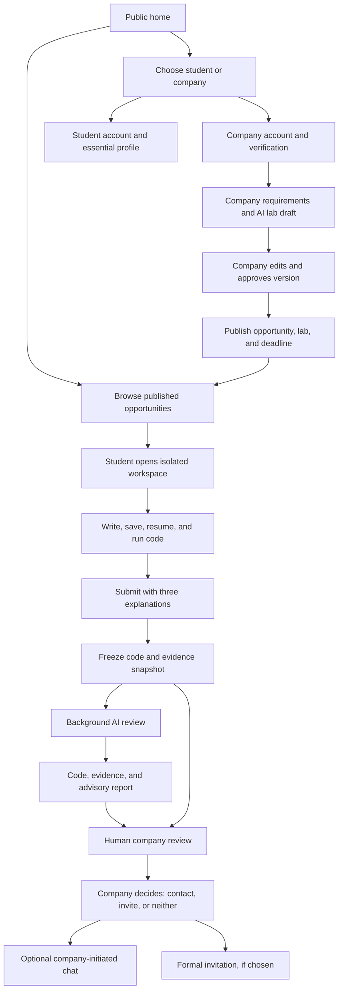
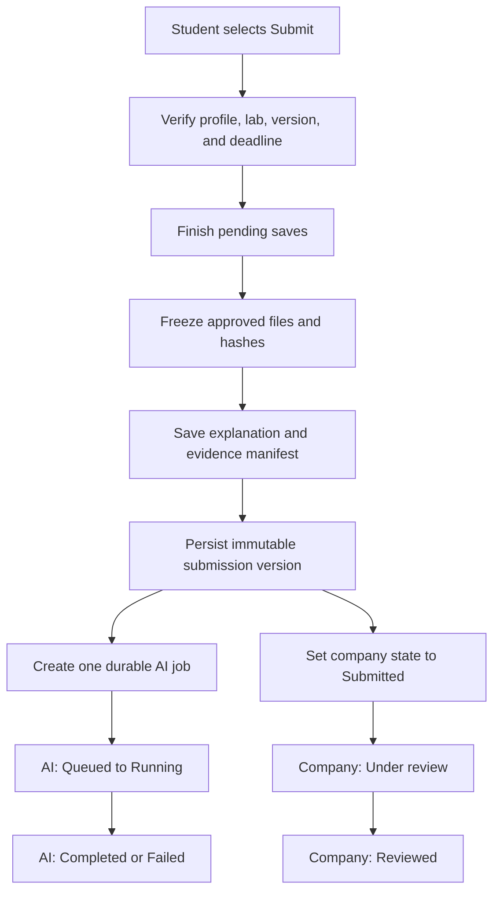
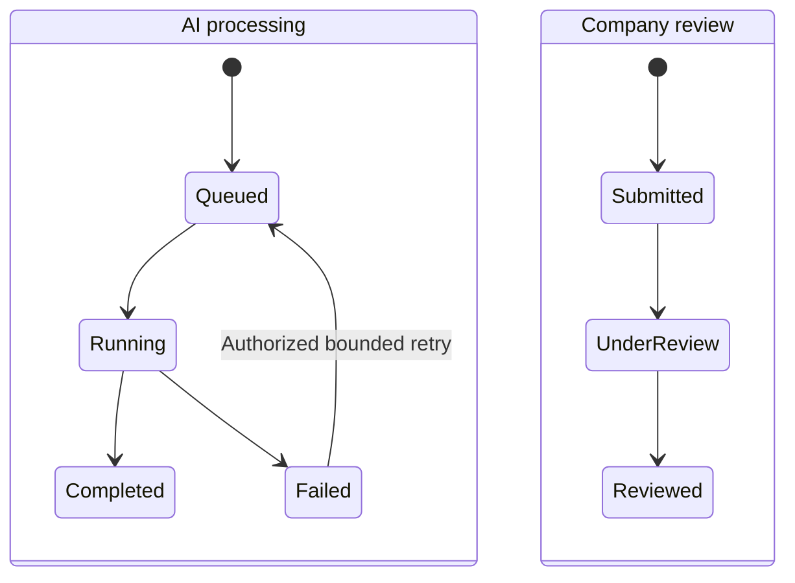
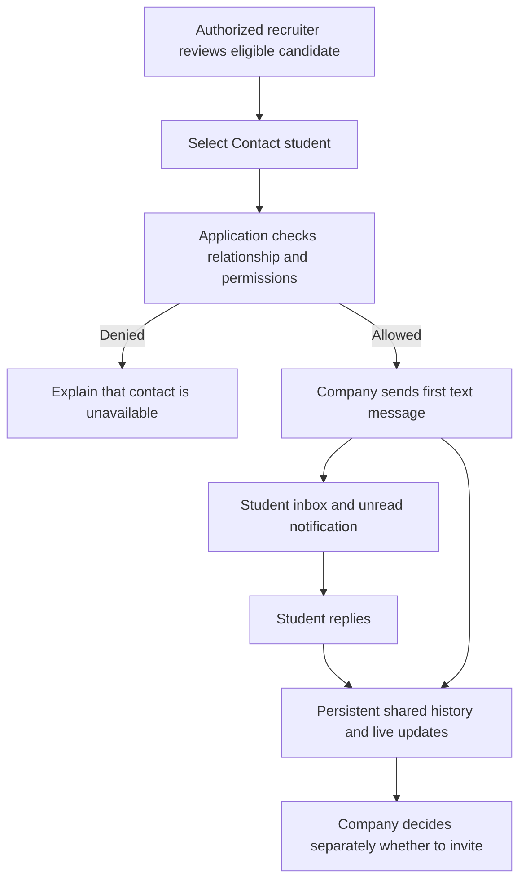
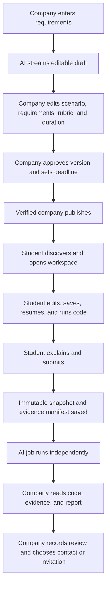
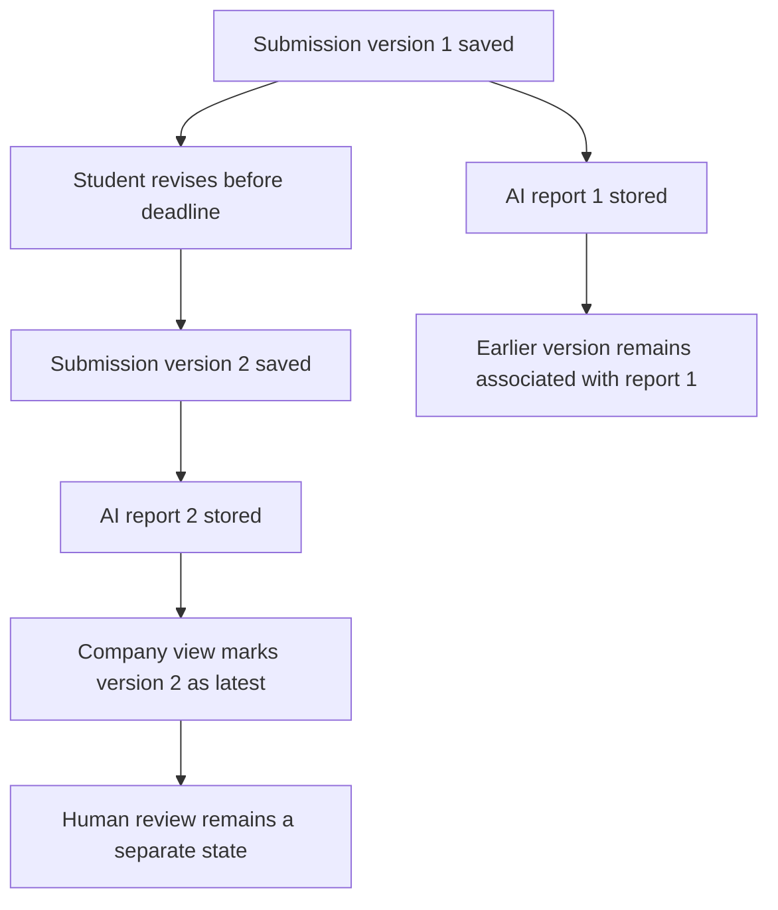
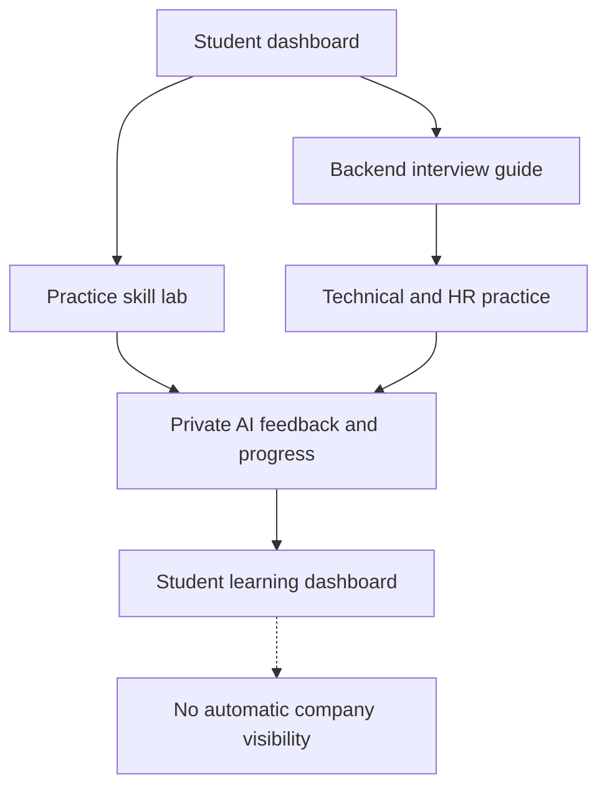
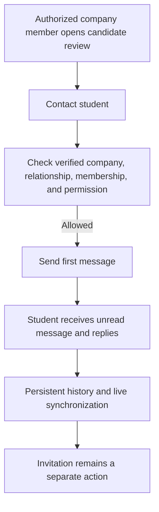

# Student labs and internship platform — feature map

**Project:** ft_transcendence — interview preparation and company labs platform

**Status:** confirmed product specification synchronized with the team ownership document. Statements marked **Confirmed** are agreed requirements. Statements marked **Proposal** or **Open** require team confirmation and must not be treated as implementation decisions.

**Scope:** product behavior, page areas, feature relationships, lifecycle rules, permissions, and testable outcomes. The optional `ai-labs-implementation-guide.md` provides implementation context, but its example stack, technology choices, numeric limits, and scoring examples are proposals unless confirmed here.

## 1. Product purpose and scope

Students prepare for interviews, practice skills, and complete company labs inside the platform. Companies define and publish labs, inspect submitted code and available evidence, read an advisory AI report, and decide whether to contact or invite a student.

The platform supports three distinct activities that must not be conflated:

1. **Learning:** private interview preparation, practice labs, feedback, and progress.
2. **Company assessment:** a versioned lab, in-platform workspace, immutable submissions, evidence, AI interpretation, and human company review.
3. **Communication:** company-initiated text chat and formal interview invitations, which remain separate.

AI helps generate labs and interpret submissions. It does not certify correctness, rank candidates, or make hiring decisions.

## 2. Complete feature inventory

| Area | Confirmed or proposed features | Main relationship |
|---|---|---|
| Public | Home, opportunity preview, published lab details, loading/empty/error states | Visitors browse without an account and choose how to engage |
| Identity | Student/company registration, sign-in/out, recovery, student GitHub/42 OAuth | Accounts reach the correct profile and dashboard |
| Student | Essential profile, dashboard, discovery, saved workspaces, submissions, results, invitations, messages | Student completes work and tracks separate AI and human states |
| Workspace | Instructions, file navigation, editor, terminal, save/resume, connection state, supported build/run actions | Student completes the primary solution in an isolated environment |
| Submission/evidence | Three short explanations, immutable code/configuration snapshot, evidence manifest, revisions, durable status | Every version remains linked to its student, lab version, and rubric |
| AI | Company lab generation, streamed preview, submission review, validated report, RAG extension point | AI output is editable/advisory and never publishes, ranks, or hires automatically |
| Company | Profile, verification, teams, opportunities, versioned labs, publication, candidate review, human decisions, invitations, analytics | Recruiters manage the opportunity lifecycle within their organization |
| Chat | Company-initiated text conversation, student replies, history, unread state, live delivery, reconnect/retry | Contact is separate from invitation; exact eligibility/grouping remain proposals |
| Preparation | Backend interview guide, technical/HR practice, practice skill labs, private feedback/progress | Learning progress does not overwrite company assessment |
| Admin/shared | Verification, user/content administration, notifications, permissions, file access | Trust rules connect students, companies, workspaces, submissions, and chat |
| Platform | LLM interface, monitoring, logs, health/status, backups/recovery, resource/evidence policies | Operational capabilities support all product flows |

**Loading state meaning:** show progress while data or a workspace is loading, followed by useful empty, disconnected, failed, or retry states where appropriate. This is cross-cutting UI behavior, not a separate product module.

## 3. Product-wide relationship map

The arrows show dependencies, not a mandatory screen sequence. AI and human review are independent state machines. Chat and invitations are separate actions.

## 4. Public home and shared identity

### 4.1 Public home and discovery

- **Audience:** visitors, students, and company members.
- **Content:** product explanation, student/company calls to action, current published opportunities, preparation introduction, company verification expectations, and links to support, privacy, and terms.
- **Visitor rule:** visitors can browse published opportunities and read approved lab details without an account.
- **Action rule:** attempting to open a workspace or submit leads through student authentication and any required profile completion.
- **Closed state:** a closed opportunity may remain visible as closed, but it does not accept new workspaces or submissions unless the team explicitly defines another policy.
- **Loading/empty/error:** distinguish loading, no matching published labs, network failure, and retry.

### 4.2 Registration, sign-in, and recovery

- Students register with name, email, and password or use GitHub/42 OAuth where available.
- Companies register with contact name, work email, password, and company name.
- Returning users sign in and reach the correct role-specific dashboard.
- Password recovery and secure session destruction are shared identity features.
- External sign-in links to one existing student identity rather than creating duplicate accounts.
- Only an authorized company member reaches company administration; only an admin reaches administration.
- **Confirmed:** students can browse before essential profile completion, but cannot submit a company lab until required fields are complete.

### 4.3 Student essential profile

Required before company-lab submission:

- name;
- chosen career path;
- skills;
- education;
- at least one project or experience entry.

Optional fields include CV, photo, short introduction, GitHub, portfolio, and 42/1337 Intra links. An Intra link is user supplied; automatic import is not part of this feature.

A company sees relevant profile information only in the context of a submission to its own lab. Exact contact-information disclosure remains an open policy.

## 5. Student experience

### 5.1 Student dashboard

The dashboard summarizes:

- relevant open company labs;
- workspaces with saved progress and resume actions;
- latest submission versions and separate AI-processing/company-review states;
- interview invitations;
- company-message inbox and unread count;
- guided preparation and practice progress;
- missing essential profile fields.

Opening a summary leads to the full detail. The dashboard does not merge practice progress with company assessment and never presents AI completion as company review completion.

### 5.2 Discover company opportunities and labs

- **List information:** title, company, role/path, location/remote status, main skills, lab summary, and deadline.
- **Details:** company context, role responsibilities, lab instructions, explicit requirements/constraints, examples where useful, deliverables, rubric summary, duration guidance, and deadline.
- **Publication gate:** a pending company may create/edit drafts; only a verified company may publish. Every published opportunity has an approved lab version and a deadline.
- **Open state:** a published lab accepts work and submissions until its deadline under the chosen extension policy.
- **Search:** the advanced-search implementation must provide filters, sorting, and pagination. The exact first-release filter set remains open.
- **Fairness:** a published task/rubric is versioned. Changes after students begin require a new version and an explicit policy for existing workspaces/submissions; requirements are never silently rewritten.

### 5.3 In-platform student workspace

#### Confirmed behavior

The workspace is the primary solution environment and includes:

- lab instructions and requirements;
- file navigation and an editor;
- a terminal;
- file saving with visible save and connection states;
- saved progress and resume behavior within a defined workspace lifetime;
- supported build/run actions where the template permits them;
- the submission action and three-question explanation form.

The team starts with one supported environment template and simple exercises. It integrates suitable existing editor and terminal components; it does not build a shell or editor from scratch.

#### Access and lifecycle

1. The backend verifies student identity, lab access, and the applicable lab version.
2. It creates or resumes a workspace record linked to the student and lab version.
3. The platform provisions only the registered template and authorized project files.
4. The student receives scoped file/terminal access, never production or infrastructure credentials.
5. Save operations return visible saved/saving/failed/disconnected state.
6. Within the defined lifetime, the student can resume the same authorized workspace and saved files.
7. At expiry or stop, the platform follows the selected persistence and cleanup policy.

#### Open implementation decisions

- exact language/framework/runtime;
- isolation technology appropriate to deployment;
- resource, process, storage, and network limits;
- workspace lifetime, idle/stop behavior, and resume window;
- exact supported build/run actions;
- whether to retain terminal transcripts.

A C++/Bubble Sort exercise may be used as a simple prototype example. It is not a confirmed stack or template decision.

### 5.4 Submission and revision lifecycle

#### Preconditions

- student is authenticated;
- essential profile is complete;
- lab/opportunity is published and open;
- server time is before the deadline;
- workspace saves and evidence capture complete successfully.

#### Submission form

The student submits the in-platform solution and answers three short questions:

1. What approach did you take?
2. What difficulty did you encounter, and how did you address it?
3. What remains incomplete or would you improve?

The explanation is a student claim, not independently verified authorship or reasoning.

#### Revision rule

- The student may continue the workspace and create a new submission version before the deadline.
- Each version is immutable and linked to the student, lab version, rubric, code snapshot, evidence manifest, and any AI report.
- The company review workspace shows the latest version as current and keeps earlier versions/reports correctly associated.
- After the deadline, no new version is accepted; a previously saved version remains reviewable.
- Repeating the same submit action must return the same result rather than create duplicates; an intentional revision creates a new version.

#### Confirmation and tracking

A successful response confirms the saved submission version and time. The student dashboard shows:

- workspace/save state;
- submitted version and time;
- AI state: Queued, Running, Completed, or Failed;
- company state: Submitted, Under review, or Reviewed;
- the current human result/invitation when available.

A failed AI request does not undo or remove a successful submission.

## 6. Evidence and submission reliability

### 6.1 Evidence categories

| Evidence | Provenance | What it supports | What it does not prove |
|---|---|---|---|
| Final source/configuration snapshot | Platform submission storage | Exact files supplied in one submission version | Authorship, correctness, or work outside the captured files |
| Approved lab version and rubric | Application database | Requirements/criteria in effect for that submission | That the requirements are fair or technically verified |
| Checkpoint/diff, if available | Platform save workflow | Some observable changes between captured versions | Every action, keystroke, motive, or complete development history |
| Managed build/run metadata | Platform execution wrapper | Supported action, code version, time, exit/timeout, and capture status | Full functional correctness |
| stdout/stderr | Program under controlled execution | Text produced by the program for that run | Truth of the text or that all tests ran |
| Terminal transcript, if collected | Terminal gateway | Partial interactive activity | A complete or reliable command history |
| Student explanations | Student form | The student's stated approach, difficulty, and limitations | Independent verification of claims |
| Evidence manifest | Backend | Included, missing, truncated, and omitted evidence plus limitations | Completeness beyond what the platform was configured to capture |

### 6.2 Reliability rules

- Every execution record is linked to the code snapshot/checkpoint actually run.
- Old successful output is not presented as proof for a later final snapshot.
- Evidence collection is bounded rather than unrestricted keystroke surveillance.
- Source files, configuration, logs, filenames, and explanations are untrusted AI input.
- Known secrets and unnecessary personal data are excluded; automated redaction is not promised to detect every secret.
- The student is informed about captured evidence and external AI processing before submission.
- Company access is restricted to authorized reviewers for that company's own submissions.
- Access, retention, deletion, file-count/size, output-byte, and model-input policies must be explicit before public student use; exact values remain open.
- A terminal transcript is never described as a guaranteed complete command history.
- If evidence is incomplete, the report and UI must say so.

### 6.3 Submission flow

### 6.4 Failure and retry behavior

- If snapshot storage fails, the UI must not confirm a successful submission.
- If the AI provider, worker, or schema validation fails, the saved submission remains available to authorized users.
- Retries are bounded and idempotent and do not create duplicate final reports.
- A browser disconnect does not cancel a durable background review job.
- The company may review the saved submission even when no AI report is available.
- Storage, metadata, and jobs require coordinated backup/recovery so database records do not point to missing snapshots.

## 7. AI product behavior

### 7.1 Scope and priority

**Confirmed:**

- one complete LLM interface;
- company lab generation;
- submission review/report generation;
- streamed company draft preview;
- error handling, rate limiting, validated structured output, and usage/failure visibility;
- interview practice and private practice feedback;
- extension point for RAG context.

**Priority order:** company lab generation and submission review come first. Interview and practice AI features remain product scope but must not displace the core company-lab flow.

**RAG is a planned deliverable:** document ingestion, text extraction, chunking, embeddings, retrieval, and grounded answers. RAG implementation follows LLM integration; both are in scope. Supplying current submission data directly to a prompt is not RAG. Do not make vector/retrieval infrastructure a first-release dependency.

### 7.2 Company lab generation

The company provides requirements such as assessed skills, level, duration guidance, template selection, constraints, and any examples. AI may stream a draft containing:

- scenario;
- instructions;
- explicit requirements and constraints;
- examples where useful;
- deliverables;
- review criteria/rubric;
- approximate expected duration.

The company can edit every generated field, resolve ambiguity, approve a version, and publish it with a deadline. AI never publishes automatically, selects arbitrary host commands, changes permissions, or provisions tools.

Draft generation is an editable proposal. A valid structure does not prove that requirements, examples, or rubric are technically correct; the company approves publication.

### 7.3 Versioned labs and rubrics

A published lab version binds together:

- scenario and instructions;
- requirements and constraints;
- examples;
- deliverables;
- rubric;
- expected duration guidance;
- workspace-template reference/version.

Regenerating a draft does not overwrite a company-edited draft or approved version. After students begin, changed requirements require a new version and an explicit policy for existing participants. Deadline changes remain visible and separate from rubric changes.

### 7.4 Submission review input

The authorized AI request may include:

- the approved lab version and rubric;
- final source/configuration files;
- relevant captured execution evidence;
- selected checkpoints/diffs if available;
- the student's three explanations;
- a manifest of missing, truncated, or omitted evidence.

The manifest must be visible to the reviewer and report. The system must not silently omit oversized or unsupported material and then claim a complete review.

### 7.5 Submission review output

The validated report contains:

- summary of the solution;
- requirement-by-requirement assessment;
- code strengths and potential problems with evidence references;
- observed work progression only where records support it;
- interpretation of available execution results;
- limitations and behavior that remains unverified;
- an approximate assessment and useful interview questions.

A finding should distinguish code review, observed execution, and student statements. `Unknown` remains available where evidence cannot support a conclusion.

### 7.6 Scoring and prohibited behavior

- **Open:** whether to show advisory numeric values and how to aggregate them.
- If included, scores are clearly advisory and not independently verified correctness.
- Missing or truncated evidence must not automatically become zero.
- No custom automated grading engine is required for this release.
- No mandatory reference solution or generated hidden-test suite is required.
- Build/run capture does not prove correctness.
- AI must not claim it executed tests without evidence.
- AI must not infer personality, honesty, or ability from speed, retries, command count, or typing behavior.
- AI must not rank candidates, automatically reject them, or make hiring decisions.

### 7.7 Separate state machines

AI `Completed` does not change company review to `Reviewed`. A failed AI job leaves the company submission intact.

### 7.8 Report visibility

- **Confirmed:** authorized company reviewers can see the submission, evidence, and report for their own lab.
- **Open:** whether students can see company-lab AI reports.
- **Confirmed:** practice feedback is private to the student by default and is not shared with companies.

The backend must enforce the selected visibility policy.

## 8. Company experience

### 8.1 Company profile, verification, and team

- Company profile includes organization name, description, website, industry, location, and logo.
- Pending companies can create/edit opportunity and lab drafts but cannot publish.
- Admin verification grants publication permission; it does not grant draft creation permission.
- Authorized organization members can be added/removed and assigned organization-scoped permissions.
- Recruiters can access only their own organization's opportunities, submissions, evidence, reports, conversations, and analytics.

### 8.2 Opportunity and lab lifecycle

- **Opportunity draft:** title, career path, responsibilities, skills, location/remote status, role context, and linked lab draft.
- **AI draft:** generated from company requirements and the selected supported-template capability description.
- **Company editing:** scenario, instructions, requirements/constraints, examples, deliverables, rubric, duration guidance, and deadline remain editable.
- **Approval:** the company explicitly approves the complete lab and rubric.
- **Publication:** a verified company publishes an approved lab version with a deadline. Every published opportunity has that approved lab and deadline.
- **Lifecycle:** draft → approved → published/open → closed. Exact editing and deadline-extension policies must be explicit and visible.

### 8.3 Candidate solution, evidence, and report review

An authorized recruiter can open a submission and see:

- student and relevant profile context;
- submission version and lab version/rubric;
- source/configuration files;
- evidence provenance and manifest;
- selected checkpoints/diffs if available;
- three student explanations;
- AI-processing status and report when available;
- earlier versions and their associated reports;
- human review state and notes.

The recruiter can mark Under review, record a result/feedback, invite, or start an eligible conversation. AI never performs those actions automatically.

### 8.4 Human review and invitation

- **Company states:** Submitted → Under review → Reviewed.
- A company may provide written feedback; whether every reviewed submission requires it remains open.
- A formal invitation is an explicit authorized action with its own status.
- Scheduling, acceptance, and external meeting-link behavior remain open.
- The result must not claim an internship offer unless the company explicitly creates an invitation.

### 8.5 Hiring analytics

The complete feature includes frontend and backend behavior:

- documented organization-scoped events;
- participation, submissions, completed reviews, messages, and invitations over time where collected;
- interactive charts and calculations;
- filters and date-range queries;
- live updates;
- exports;
- access control and empty/error states.

Analytics describes aggregate company activity. It does not rank candidates, infer competence from activity, or expose one company's data to another.

## 9. Company-initiated student chat

### 9.1 Confirmed behavior

- A company initiates a text conversation; the student may reply.
- The student cannot create an unsolicited company conversation.
- Messages and history persist across refreshes and sign-in sessions.
- Both dashboards/inboxes show unread state, live delivery, loading, sent, failed, and retry behavior.
- Reconnect recovers missed messages without silently duplicating them.
- Only the student and currently authorized company members can read or send.
- Company messages identify the recruiter.
- Chat and formal interview invitations are separate.
- The first release does not include friends, voice/video, or chat attachments.

### 9.2 Proposals requiring confirmation

- **Eligibility proposal:** a verified company may start chat from a candidate submission to one of its own labs. The exact eligibility rule remains open.
- **Grouping proposal:** one conversation per student and opportunity, shared by authorized company reviewers. Grouping and membership-change behavior remain open.
- The proposal assumes a candidate relationship already exists; arbitrary student outreach is not assumed.

### 9.3 Chat flow

### 9.4 Ownership

| Chat deliverable | Owner | Supporting boundary |
|---|---|---|
| Conversation model, history, unread, authorization, and live workflow | **Owner to be assigned** | Jamal reviews permissions; Mohamed supports deployment |
| Student inbox, history, replies, reconnect, and retry UI | Adam | Uses the shared messaging contract |
| Company contact action and inbox | Salah | Contact remains separate from invitation |
| Cross-company, removed-member, and unauthorized-access tests | Jamal | **Owner to be assigned** fixes implementation findings |

## 10. Administration, notifications, and shared platform behavior

### 10.1 Administration

- Approve or reject company verification with a useful explanation.
- Manage accounts and roles under explicit admin permissions.
- Handle reported content according to an agreed moderation policy.
- Keep admin actions distinguishable and auditable where required.

### 10.2 Notifications

Potential in-product events include:

- relevant published labs;
- submission saved/version created;
- AI review failed or completed for authorized viewers;
- company review result;
- interview invitation;
- new chat message.

Delivery channel and exact timing remain open. Notifications must link to an authorized detail view and must not expose private practice feedback, workspace contents, or reports to the wrong account.

### 10.3 Shared platform requirements

- Reusable API errors, validation, pagination, idempotency, and authorization conventions.
- Prometheus/Grafana metrics, useful dashboards, alerts, and secured access.
- ELK log collection/transform, indexing/search, visualization, retention, and secured access.
- Health/status, backups, and a demonstrated recovery procedure for metadata and protected evidence storage.
- Monitoring must avoid dumping source code, secrets, message bodies, or private reports into ordinary logs.

## 11. Feature ownership summary

The ownership document is authoritative for cards and review boundaries. This table keeps the product map aligned.

| Member | Feature ownership |
|---|---|
| Mohamed | Product priorities/acceptance; workspace templates, provisioning, lifecycle, storage infrastructure, resource controls, execution capture, deployment/monitoring; AI integration and streaming with Simo |
| Simo | LLM integration and RAG; AI behavior, prompts, schemas, quality evaluation with Mohamed |
| Jamal | Technical leadership and critical reviews; authentication/security/admin; workspace isolation/access review; selected backend work |
| Adam | PM coordination; student features; workspace UI and editor/terminal integration; save/resume states; explanations and submission status; student chat; preparation progress APIs |
| Salah | Company features and public home; generation form, streamed preview, lab editor/approval/publication; candidate solution/evidence/report UI; company chat and human decisions; complete analytics frontend/backend |
| **Owner to be assigned** | Submission snapshots/versioning; evidence metadata; durable AI jobs/retries/report access; existing submissions, human reviews, invitations, notifications, and messaging |

For shared work, split interface, service, infrastructure, security, and quality concerns into independently owned deliverables with named reviewers and dependencies.

## 12. End-to-end journeys

### 12.1 Company lab: generation to decision

### 12.2 Revision and state separation

### 12.3 Learning and private practice

### 12.4 Company-initiated chat

## 13. Short text flows

**Visitor to student:** Home → Browse published opportunity → Open lab details → Register/sign in → Complete essential profile if needed → Open workspace → Save/resume → Run supported action → Submit three explanations.

**Visitor to company:** Home → Register/sign in → Complete company profile → Verification pending → Create opportunity and lab draft → Generate/edit/approve lab → Set deadline → Publish after verification.

**Submission:** Lab page → Workspace → Finish saves → Submit → Immutable snapshot and evidence manifest → Receipt → AI queued/running → Company sees Submitted → Under review → Reviewed.

**Revision:** Open existing workspace before deadline → Make changes → Submit intentionally → New immutable version → New evidence/review job → Earlier version/report remain correctly associated.

**AI failure:** Provider/worker/schema fails → AI state Failed → Submission remains saved → Company may still review authorized code/evidence → Authorized bounded retry does not duplicate final report.

**Chat:** Candidate review → Contact student → Eligibility/permission check → Company message → Student unread notification → Student reply → Persistent history/live delivery → Separate invitation decision.

## 14. Module alignment and boundaries

### 14.1 Planned mapping

| Planned module | Potential points | Requirement that must be fully demonstrated |
|---|---:|---|
| Frontend/backend frameworks | 2 | Working frontend and backend applications using the selected frameworks |
| ORM | 1 | Working persistence/model implementation through an ORM |
| Advanced permissions | 2 | Reusable role, organization, resource, and access checks with meaningful isolation tests |
| Advanced search | 1 | Filters, sorting, and pagination rather than one selector |
| File management | 1 | Supported types, validation, access-controlled storage, previews/progress where relevant, and management beyond a basic upload |
| Prometheus/Grafana | 2 | Metrics integrations/exporters, useful dashboards, alerting rules, and secured dashboard access |
| ELK | 2 | Collect/transform logs, index/search, visualized views, and secured retention/access handling |
| Health/status/backups/recovery | 1 | Health/status behavior, backups, and a demonstrated restore/recovery procedure |
| LLM interface | 2 | One complete interface with generation, streaming, error handling, rate limiting, and validated structured output |
| Organizations | 2 | Organization create/edit/delete, member management, and organization-scoped actions |
| OAuth | 1 | Working external student sign-in and safe linking to an existing identity |
| Advanced analytics | 2 | Interactive visualizations, live updates, exports, and date/filter queries |
| Real-time features through fully implemented live chat | 2 | Persistent messages, unread state, live delivery, reconnect/retry behavior, and authorization |
| **Total without RAG** | **21** | **Conditional planned inventory, not completed or awarded points** |
| Optional RAG | +2 | Substantial curated dataset, user Q&A, retrieval, and response generation; planned total becomes 23 |

The subject requires **14 points**, with additional bonus **capped at 5**. Therefore 21 and 23 are conditional module inventories, not promises of awarded points.

### 14.2 What does not add automatic points

- Company generation, interview practice, and submission review are uses of **one** LLM interface module, not separate modules.
- Basic registration is not the complete standard-user-management module.
- Chat is not the separate user-interaction module without its required friends functionality.
- Editor, terminal, workspace isolation, snapshots, and execution capture do not automatically count as extra subject modules.
- Ordinary CI/CD does not automatically count as an extra module.
- Using an AI container does not automatically count as an extra module.
- Supplying current context directly to a model is not RAG.

Each module must satisfy all stated subject requirements. Partial implementations, planned work, or a UI mockup cannot be counted as completed.

## 15. End-to-end acceptance walkthroughs

### 15.1 Company-generated lab and human decision

1. A visitor reads a published Backend lab without signing in and sees the approved requirements, rubric summary, duration guidance, and deadline.
2. A pending company creates a draft and requests an AI-generated lab; streamed content remains editable and cannot publish automatically.
3. The company edits requirements, examples, deliverables, rubric, and duration guidance, approves version 1, and publishes it with a deadline after verification.
4. A student signs in, completes missing essential profile fields, opens the lab, and sees the version-bound workspace.
5. The student navigates files, edits code, saves, loses/reconnects connection visibly, resumes saved work, and uses a supported build/run action.
6. The student answers the three explanation questions and submits.
7. The platform confirms a fixed submission version and saves source/configuration plus an evidence manifest; execution evidence is linked to the exact code run.
8. AI state moves independently through Queued, Running, and Completed or Failed. Company state begins at Submitted.
9. The recruiter sees the latest code, provenance-labeled evidence, explanations, report limitations, and earlier versions/reports in their correct association.
10. The recruiter records Under review and then Reviewed, provides feedback, and explicitly chooses whether to invite or start an eligible conversation.
11. Another company cannot access the workspace, submission, evidence, report, or conversation.

### 15.2 Revision and failure reliability

1. Version 1 and its AI report remain available after the student intentionally submits version 2 before the deadline.
2. The company view identifies version 2 as latest while keeping version 1 and report 1 associated with version 1.
3. Repeating one submit request does not create duplicate versions; retries after AI failure do not create duplicate final reports.
4. With the provider unavailable, the submission remains saved and the company can still access authorized code/evidence.
5. A failed snapshot save is not shown as a successful submission.
6. A run from an older checkpoint is not described as evidence for the final snapshot.

### 15.3 Workspace privacy and evidence boundaries

1. One student cannot navigate, edit, or connect to another student's workspace by changing an identifier.
2. The workspace does not contain model-provider keys, production secrets, host infrastructure credentials, or unrestricted production database access.
3. Source files/logs containing instruction-like text are treated as data and do not change AI instructions.
4. Missing/truncated/omitted evidence appears in the manifest and report limitations.
5. A terminal transcript is labeled partial if shown; platform-captured output, program text, and student claims remain visibly distinct.
6. The student sees what is captured and receives notice of external AI processing before submission.

### 15.4 Company-initiated chat

1. An authorized recruiter starts from an eligible candidate review, passes relationship/membership checks, and sends the first text message.
2. The student receives an unread message, reads it, and replies; both sides see persistent history and live updates.
3. Refresh/reconnect restores history and missed messages without silently duplicating sends.
4. Another student, unrelated company, and removed company member cannot read or subscribe to the conversation.
5. A chat message does not create or replace a formal invitation.
6. Eligibility and grouping follow the team's final confirmed policy; until then they remain proposals.

### 15.5 Learning separation

1. The same student completes guided Backend preparation and a practice lab.
2. Practice feedback and progress are private to the student by default.
3. Practice completion does not change company-lab submission/review state.
4. AI practice feedback remains guidance, not an employer verdict or hiring signal.

## 16. Product-wide rules and release boundary

- A real company lab is always associated with one company opportunity; a practice lab never represents a company opening.
- A pending company can draft; only a verified company can publish an approved lab version and deadline.
- Anyone may browse published opportunities. Submission requires student authentication and essential profile completion.
- The primary solution is completed and submitted inside the platform; an external repository link is not required.
- Students may revise before the deadline. Each version is immutable and the company sees the latest while earlier versions/reports remain associated.
- Workspace, source, evidence, AI input/output, and reports are protected by student/company/admin authorization.
- AI never publishes, executes arbitrary tools for review, claims unrecorded tests, ranks candidates, or hires.
- AI completion and human company completion are independent.
- Company-initiated chat is in scope; exact eligibility/grouping remain proposals. Friends, voice/video, and attachments are not in this release.
- Accounts and Profiles are the first platform milestone. AI generation/review prototyping may proceed in parallel after initial interface agreements.
- Confirmed product scope does not imply every feature has the same delivery date. The team must estimate, sequence, and accept deliverables.

## 17. Confirmed scope, proposals, and open decisions

### 17.1 Confirmed

- In-platform editor/terminal workspace is the primary company-lab solution model.
- One supported template and simple exercises are the starting direction.
- Existing editor/terminal components are integrated rather than rebuilt from scratch.
- Saved workspace progress and resume behavior are required within a defined lifetime.
- Company-generated labs are editable, approved by the company, versioned, and published with a deadline.
- Submission snapshots, bounded evidence, three explanations, background AI review, and human review are separate related behaviors.
- Company-lab AI report student visibility is not yet decided; practice feedback is private by default.
- Company-initiated text chat is included; eligibility and grouping need confirmation.
- Complete LLM interface is committed; RAG is a planned deliverable (document ingestion, text extraction, chunking, embeddings, retrieval, and grounded answers).

### 17.2 Proposals, not confirmed implementation choices

- C++/Bubble Sort as a sample lab.
- Any particular editor, terminal, model provider, queue product, isolation technology, or service language.
- A database-backed job implementation as the smallest useful durable worker.
- Specific evidence counts, output limits, numerical scoring values, or report visibility default.

### 17.3 Open decisions

- First template language/framework and actual starter exercise.
- Isolation technology, resource limits, workspace lifetime, and resume/expiry behavior.
- Supported build/run actions and terminal transcript policy.
- Evidence size/count limits, retention/deletion, access, secrets filtering, and provider data handling.
- Whether students see company-lab AI reports and whether advisory numbers are shown.
- Chat eligibility, grouping, and membership-change behavior.
- Required written feedback, invitation scheduling/acceptance, notification channels, and search filters.
- Model/provider selection and RAG implementation details after confirmed scope is stable.

The team must decide these items explicitly. This feature map does not select a stack, provider, deadline, numeric limit, or unresolved policy.
