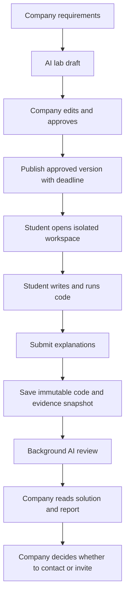

# Team roles, delivery ownership, and implementation boundaries

**Project:** ft_transcendence — interview preparation and company labs platform

**Status:** confirmed roles and product boundaries are separated from implementation proposals and open decisions. The optional `ai-labs-implementation-guide.md` supplies useful context, but its technology choices, sample labs, numeric limits, and scoring examples are proposals unless this document or the feature map confirms them.

**Purpose:** assign independently deliverable work, reviewers, dependencies, and acceptance responsibility. A named owner is responsible for delivery; collaboration does not remove that accountability.

## 1. Confirmed team roles and governance

| Member | Confirmed role | Primary responsibility | Coordination responsibility |
|---|---|---|---|
| Mohamed | Product Owner, DevOps developer, AI partner | Product priorities and acceptance; workspace infrastructure; deployment and monitoring; AI integration and streaming with Jamal | Works with Jamal on AI behavior, prompts, schemas, and quality; accepts user-visible behavior |
| Jamal | Technical Lead, Security developer, AI partner | Technical architecture and critical reviews; authentication, authorization, administration, and file security; AI protection and quality with Mohamed | Leads architecture decisions and unblocks technical dependencies |
| Adam | Project Manager, Fullstack 1, student experience | Student product flows; student workspace UI; saved progress and submission status; preparation progress | Coordinates delivery, dates, meetings, and blockers; does not set product priorities alone |
| Salah | Fullstack 2, company experience and public home | Company lab generation and publication UI; candidate review UI; company features; public home; company chat; complete hiring analytics frontend/backend | Coordinates company-side contracts with shared services |
| Hicham | Backend developer, shared business workflows | Submission snapshots and jobs; evidence metadata; durable workflows; reviews, invitations, notifications, and messaging | Builds reusable automation rather than manually handling every scenario or submission |

### Governance boundaries

- **Mohamed owns priorities and acceptance.** He maintains the product vision, clarifies requirements, orders the backlog, writes or approves acceptance criteria, resolves product questions, and validates completed user behavior.
- **Adam coordinates delivery and blockers.** He maintains milestones, dependencies, meetings, and blockers and helps the team make delivery decisions. He does not replace Mohamed's product authority.
- **Jamal leads technical architecture and critical reviews.** He coordinates architecture, cross-cutting interfaces, security reviews, and high-risk technical decisions.
- **Everyone implements, tests, reviews, and documents their work.** Product ownership does not remove engineering work, and technical leadership does not remove implementation work.
- **AI work is shared by Mohamed and Jamal.** Mohamed owns infrastructure and integration; Jamal owns security, schemas, review logic, and quality evaluation. Neither is presented as the sole AI owner.

## 2. Shared domain boundaries

The team must use the same terms across interfaces, storage, reports, and reviews.

| Term | Confirmed meaning | Main owners |
|---|---|---|
| **Lab version** | Immutable published instructions, requirements, examples, deliverables, rubric, and template reference | Salah, Hicham; Jamal reviews schemas and feasibility |
| **Workspace template** | One supported environment definition with its runtime, tools, supported actions, resource policy, and version | Mohamed, Jamal |
| **Student workspace** | Authorized in-platform environment for instructions, files, editor, terminal, save/resume state, supported build/run actions, and submission | Mohamed, Adam, Hicham, Jamal |
| **Submission snapshot** | Fixed source/configuration set linked to one student, one lab version, one rubric, and one submission version | Hicham |
| **Execution evidence** | Supported build/run metadata and captured output linked to the exact code version actually run | Mohamed, Hicham |
| **Evidence manifest** | Record of included, missing, truncated, and omitted evidence plus capture limitations | Hicham, Jamal |
| **AI review job** | Durable background request tied to one immutable submission snapshot | Hicham; Mohamed and Jamal own AI behavior |
| **AI report** | Advisory, requirement-based interpretation of code and available evidence; never a certified test result or hiring decision | Mohamed, Jamal; Hicham stores and protects it |
| **Company review** | Human workflow: Submitted → Under review → Reviewed | Hicham, Salah |
| **Conversation** | Company-initiated text chat, separate from a formal interview invitation | Hicham, Adam, Salah, Jamal |

## 3. Individual ownership

### 3.1 Mohamed — Product Owner, DevOps, and AI partner

#### Product ownership

- Maintain the product vision, priorities, milestone outcomes, and acceptance criteria.
- Decide which requirements belong to the confirmed product and which remain proposals.
- Resolve open product questions and validate completed behavior with evaluators and peers.
- Accept company-lab generation, workspace, submission, AI report, review, and chat behavior against written criteria.

#### Workspace and platform infrastructure

- Own workspace template definitions, provisioning, lifecycle, persistent storage infrastructure, resource controls, and supported execution capture.
- Own deployment, monitoring, backup coordination, and operational recovery for the application and workspace services.
- Keep production secrets, infrastructure credentials, and model-provider credentials outside student workspaces and client code.
- Work with Jamal to validate isolation, network policy, filesystem boundaries, process limits, cleanup, and recovery.

#### AI integration

- Implement the server-side LLM adapter, streaming path, timeouts, usage tracking, and operational failure handling with Jamal.
- Integrate generation and review jobs without making retrieval infrastructure a first-release dependency.
- Design the request-builder extension point for optional RAG context, but do not build an empty vector system now.

#### Boundary

Mohamed owns product acceptance and the infrastructure/integration side of AI. Jamal owns AI security, prompt/schema logic, and quality review. Hicham owns durable submission and report workflows. Neither Mohamed nor Jamal alone owns the complete AI feature.

### 3.2 Jamal — Technical Lead, Security developer, and AI partner

#### Technical leadership

- Lead architecture decisions, interface contracts, critical reviews, and technical blocker resolution.
- Review high-risk workspace isolation, evidence access, AI input/output boundaries, and cross-service trust.
- Ensure decisions are documented and that security controls are testable rather than assumed.

#### Existing security ownership

- Authentication, password/session handling, recovery, GitHub/42 OAuth, and account linking.
- Authorization for student, company, organization, and admin roles.
- Company verification, user administration, reported-content administration, and protected file access.
- Organization membership changes, removed-member access, cross-company isolation, and audit/access review.

#### Workspace and AI protection

- Review workspace isolation and authorized access with Mohamed.
- Review AI input/output protection, prompt-injection resistance, schema validation, shared rate limits, and provider-data handling.
- Define and evaluate generation prompts, review prompts, output schemas, review logic, and AI quality cases with Mohamed.
- Ensure source files, logs, filenames, and student text are treated as untrusted input and cannot change application instructions.

#### Boundary

Jamal leads and reviews; he does not become the manual reviewer for every lab. Hicham implements reusable jobs and storage. The company remains responsible for human decisions.

### 3.3 Adam — Project Manager, Fullstack 1, and student experience

#### Coordination

- Coordinate milestones, delivery sequence, meetings, dependencies, and blockers.
- Make schedule and capacity constraints visible; do not claim equal workload without estimates and actual effort.
- Keep the team focused on the confirmed Accounts and Profiles milestone while allowing explicitly agreed AI prototyping in parallel.

#### Student product ownership

- Student registration/profile UI, student dashboard, discovery, submission tracking, results, invitations, interview guide, and practice progress APIs.
- Student workspace UI: instructions, file navigation, editor integration, terminal integration, visible save/connection state, resume state, supported build/run actions, and submission.
- Three-question submission explanation form: approach, difficulty encountered, and remaining limitations.
- Student submission and AI-processing status, with human company-review status kept separate.
- Student inbox, conversation history, unread state, replies, loading/sent/failed/retry states, and reconnection behavior.
- Preparation progress and private practice feedback, kept separate from company-lab assessment.

#### Boundary

Adam integrates existing editor and terminal components and platform APIs. He does not build a shell or editor from scratch, define infrastructure isolation, or implement every backend workflow.

### 3.4 Salah — Fullstack 2, company experience, and public home

#### Company product ownership

- Company registration/profile UI, company dashboard, organization team management, opportunities, publication lifecycle, and notifications UI.
- Company requirements form, streamed AI draft preview, editable lab content, rubric, version approval, and publication with a deadline.
- Candidate review UI showing source/configuration files, evidence provenance, AI report limitations, submission versions, and human decision actions.
- Company inbox, company-initiated conversations, history, unread state, replies, and contact actions.
- Public home and opportunity discovery presentation.

#### Analytics ownership

- Own the complete hiring analytics feature: event definitions with Hicham, backend queries and APIs, frontend calculations/visualizations, filters, live updates, exports, and access rules.
- Analytics must be organization-scoped and must not rank candidates or turn activity metrics into competence scores.

#### Boundary

Salah owns the company-facing experience and complete analytics feature. AI output remains advisory, and only an authorized company member makes contact or invitation decisions.

### 3.5 Hicham — Backend developer and shared workflows

#### Workspace and submission services

- Authorized workspace session/file/terminal integration APIs with Mohamed's runtime and Jamal's security review.
- Submission snapshot coordination, versioning, idempotency, deadline enforcement, and immutable evidence references.
- Evidence manifest metadata and links between runs, checkpoints, code versions, submissions, lab versions, and rubrics.
- Durable review jobs, bounded retries, report storage, status APIs, and authorized report access.
- Ensure a failed AI request never removes a saved submission and retries do not create duplicate submissions or final reports.

#### Existing shared workflows

- Submission lifecycle, human company reviews, invitations, notifications, and company–student messaging.
- Cross-feature data relationships and API conventions.
- Organization-scoped authorization checks in every relevant workflow, using Jamal's shared access rules.

#### Automation boundary

Hicham builds reusable automation. He does not manually evaluate every lab, manually inspect every AI result, or implement scenario-specific hidden tests for the first release. New scenarios should use the common submission and review workflow.

## 4. Company-lab journey and ownership

| Stage | Primary owner | Required contribution | Reviewer/dependency |
|---|---|---|---|
| Product acceptance and scope | Mohamed | Acceptance criteria, priorities, confirmed/open status | Whole team |
| AI generation service | Mohamed | Provider integration, streaming, timeouts, usage and failure handling | Jamal; Hicham for API/job integration |
| Generation prompts and schemas | Jamal | Safe instructions, structured draft, rubric validation, quality cases | Mohamed |
| Company generation and lab editor | Salah | Requirements form, streamed preview, edits, approval, publication | Adam for shared UI patterns; Hicham for versions; Jamal for permissions |
| Workspace template and lifecycle | Mohamed | Provisioning, persistence infrastructure, limits, cleanup, supported actions | Jamal; Hicham for APIs |
| Workspace session and file APIs | Hicham | Authorization, lab-version binding, file paths, resume state | Jamal; Mohamed |
| Student workspace UI | Adam | Editor/terminal integration, save/connection state, explanations, submission | Salah; Hicham and Mohamed |
| Submission snapshot | Hicham | Fixed version, evidence manifest, idempotency, deadline checks | Mohamed; Jamal |
| Execution capture | Mohamed | Managed command metadata, output, exit/timeout, code-version association | Hicham; Jamal |
| Durable AI job and report storage | Hicham | Queue/retry/recovery, status, authorized report access | Jamal; Mohamed |
| AI review logic | Jamal | Advisory report, evidence references, limitations, quality evaluation | Mohamed; Hicham |
| Candidate review UI | Salah | Code/evidence/report side by side and human decision actions | Adam; Hicham; Jamal |
| Contact or invitation | Salah | Company action and UI | Hicham; Adam for student inbox; Jamal for permissions |

Every stage must be split into cards with one primary owner. A broad card such as “build AI” is not ready for implementation.

## 5. Workspace and evidence ownership

### 5.1 Confirmed first-release behavior

- Students complete company labs inside the platform.
- The workspace includes lab instructions, file navigation, an editor, a terminal, file saving, visible save and connection states, resume behavior, supported build/run actions where applicable, and the submission form.
- The team starts with one supported environment template and simple exercises.
- The team integrates existing editor and terminal components; it does not build a shell or editor from scratch.
- Saved workspace progress exists within a defined lifetime, and students can resume it.
- A company may extend an open deadline under an explicit, visible policy; the team has not selected the exact dates or policy details.

### 5.2 Open implementation choices

The following remain proposals or open decisions:

- Exact language, framework, compiler/runtime, and starter files for the first template.
- Isolation technology appropriate to the deployment.
- CPU, memory, process, storage, network, and time limits.
- Workspace lifetime, stop/idle behavior, resume window, and recovery behavior.
- Whether terminal transcripts are collected in the first release.
- Exact supported build/run actions and arguments.

A C++/Bubble Sort example illustrates a simple exercise only. It is not a confirmed stack, template, or assessment decision.

### 5.3 Evidence rules

- Every submission has a fixed snapshot linked to the student, lab version, rubric, and submission version.
- Every execution record is linked to the code version actually run; old runs are not presented as proof of later code.
- Collection is bounded. It is not unrestricted keystroke surveillance and does not attempt to reconstruct every student action.
- Checkpoints and diffs are optional supporting evidence, not proof of authorship or complete reasoning.
- The evidence manifest distinguishes:
  - platform-captured metadata;
  - program-produced output;
  - student claims and explanations;
  - missing, truncated, or omitted material.
- Terminal transcripts are partial and are not guaranteed complete command histories.
- Source files, configuration, logs, filenames, and student explanations are untrusted input.
- Secrets and unnecessary personal data must be excluded from AI context and ordinary logs.
- Students are informed about evidence capture, external AI processing, and the available review before submitting.
- Access controls, retention periods, deletion rules, file limits, evidence limits, and provider handling need explicit written policies before public student use; exact values are not yet selected.

## 6. AI scope, review contract, and reliability

### 6.1 Confirmed scope

- A complete LLM interface is committed.
- Company lab generation and submission review are the first AI priorities.
- Interview practice and private practice feedback remain in the product.
- RAG is optional later, only if time remains. The request builder should expose an extension point for retrieved context without making retrieval infrastructure a release dependency.

### 6.2 Lab generation contract

The company may provide requirements to generate a draft containing:

- scenario and instructions;
- explicit requirements and constraints;
- examples where useful;
- deliverables;
- review criteria/rubric;
- approximate duration guidance.

The company edits and approves the draft. Publication saves a versioned lab and rubric. Requirements, examples, criteria, and template references must not silently change after students begin; a changed task requires a new version and an explicit policy for affected students.

### 6.3 Submission review input

The AI request may contain only authorized, policy-compliant data:

- the approved lab version and rubric;
- final source and configuration files;
- relevant captured execution evidence;
- selected checkpoints or diffs when available;
- the student's three short explanations;
- a manifest of missing, truncated, or omitted evidence.

### 6.4 Submission review output

The report returns:

- a summary of the solution;
- a requirement-by-requirement assessment;
- code strengths and potential problems with evidence references;
- observed work progression only where records support it;
- interpretation of available execution results;
- limitations and unverified behavior;
- an approximate assessment and useful interview questions.

An exact numeric scoring policy remains open. If advisory values are included, they must be clearly labeled as advisory, and missing evidence must not automatically become zero.

### 6.5 Prohibited interpretations and features

- No custom automated grading engine, mandatory reference solution, or generated hidden-test suite is required for this release.
- Build/run capture is allowed, but it does not prove correctness.
- AI must not claim it executed tests without evidence.
- AI must not infer personality, honesty, or ability from working speed, retries, command count, or typing behavior.
- AI must not rank candidates, reject candidates, or make hiring decisions.
- Multiple generation and review features count as one complete LLM interface module, not separate modules.

### 6.6 Separate state machines

| State machine | States |
|---|---|
| AI processing | Queued → Running → Completed / Failed |
| Company review | Submitted → Under review → Reviewed |

AI completion does not complete company review. A failed AI request does not lose the submission. Retries use bounded, idempotent behavior and do not create duplicate submissions or final reports.

## 7. Company-initiated student chat

### Confirmed behavior

- A company initiates a text conversation; the student may reply.
- Messages and history persist across refreshes and sessions.
- Both sides receive live delivery, unread state, reconnection, and visible loading/sent/failed/retry behavior.
- Only the student and currently authorized members of the company can access the conversation.
- Company messages identify the recruiter who sent them.
- Chat and formal interview invitations are separate. A conversation is not an invitation, offer, or automatic hiring decision.
- The first release does not include friends, voice/video, or chat attachments.

### Proposals requiring confirmation

- **Eligibility proposal:** a verified company may start chat from a submission to one of its own labs. The exact rule must be confirmed before implementation.
- **Grouping proposal:** one conversation per student and opportunity, shared by authorized company reviewers. The team must confirm grouping and membership-change behavior.

### Ownership and acceptance

| Deliverable | Primary owner | Reviewer | Dependency |
|---|---|---|---|
| Conversation model, authorization, history, unread, and live workflow | Hicham | Jamal | Student, lab, company, and organization relations |
| Student inbox and reply states | Adam | Salah | Agreed messaging contract |
| Company contact action and inbox | Salah | Adam | Candidate-review relationship and permissions |
| Cross-account, removed-member, and cross-company tests | Jamal | Hicham | Completed chat workflow |

The student cannot initiate an unsolicited company conversation. A failed send remains visible and retryable; reconnecting must not silently duplicate messages or conversations.

## 8. Existing feature ownership matrix

| Feature | Interface owner | Main service/rule owner | Required reviewers/support |
|---|---|---|---|
| Student authentication | Adam | Jamal | Hicham for data relationships |
| Company authentication | Salah | Jamal | Hicham for data relationships |
| Student profile | Adam | Adam | Jamal for access; Hicham for shared model |
| Company profile | Salah | Salah | Jamal for verification and files |
| Company teams | Salah | Salah | Jamal for membership and permissions |
| Opportunity publication | Salah | Salah | Jamal for publication permission; Hicham for versions |
| Company lab workspace | Adam | Mohamed and Hicham by layer | Jamal for isolation/access |
| Company lab submission | Adam | Hicham | Mohamed for snapshot hooks; Jamal for evidence access |
| AI lab generation | Salah | Mohamed and Jamal by layer | Hicham for integration |
| Candidate review | Salah | Hicham | Jamal for access; Mohamed for acceptance |
| Invitations | Adam and Salah on their side | Hicham | Jamal for permissions |
| Notifications | Adam and Salah on their side | Hicham | Mohamed if delivery infrastructure is needed |
| Hiring analytics | Salah | Salah | Hicham for agreed events; Jamal for company isolation |
| Company–student chat | Adam and Salah on their side | Hicham | Jamal for access; Mohamed for live deployment |
| Admin features | Jamal | Jamal | Mohamed for product rules |
| Monitoring/logging/recovery | Mohamed | Mohamed | Everyone instruments and documents their services |

## 9. Delivery sequence and first milestone

### Accounts and Profiles: first platform milestone

| Card | Primary owner | Reviewer(s) | Dependency |
|---|---|---|---|
| Account/profile acceptance criteria | Mohamed | Whole team | Confirmed product scope |
| Account/profile/organization data model | Hicham | Jamal, Adam, Salah | Acceptance criteria |
| Shared registration and sessions | Jamal | Hicham | Agreed data model |
| Password recovery | Jamal | Hicham | Authentication contract |
| Student registration/profile screens | Adam | Jamal, Hicham | Authentication and profile model |
| Company registration/profile screens | Salah | Jamal, Hicham | Authentication and profile model |
| Admin company verification | Jamal | Salah, Mohamed | Company model and product rules |
| Account/profile integration walkthrough | Hicham | Adam, Salah, Jamal | Feature branches integrated |
| Milestone acceptance | Mohamed | Whole team | Testable user behavior |

OAuth remains an agreed feature and can be scheduled after basic accounts if capacity requires it. This is sequencing, not removal.

### Parallel AI prototyping

After the team agrees the initial LLM input/output contracts and evidence boundaries, Mohamed and Jamal may prototype generation and submission review in parallel with Accounts and Profiles. The prototype should use a manually prepared submission package before workspace complexity is introduced.

### Later delivery sequence

1. Complete Accounts and Profiles.
2. Agree company-lab generation, versioning, workspace, evidence, and report contracts.
3. Deliver one company-generated, approved, versioned lab and one supported student workspace.
4. Deliver immutable submission, evidence manifest, background review, and company candidate review.
5. Deliver basic text chat and live delivery.
6. Complete live-delivery resilience, search, analytics, OAuth, and remaining agreed features as capacity allows.

This sequence is a dependency order, not a fixed deadline or proof that every feature fits the same milestone.

## 10. Concrete implementation cards

Each row is independently estimable. A listed collaborator is not a co-owner unless the team explicitly splits and assigns a separate deliverable.

### AI contract and prototype

| Card | Primary owner | Reviewer(s) | Dependencies and done condition |
|---|---|---|---|
| Define one sample lab-generation request and expected draft | Mohamed | Jamal | Confirmed fields; manually reviewed example stored |
| Define one manual submission evidence package and expected report | Jamal | Mohamed, Hicham | Rubric, files, explanations, evidence manifest, limitations |
| Implement one server-side generation request | Mohamed | Jamal | Provider credentials kept outside code/workspace; input/output logged safely |
| Implement one manual AI review request | Jamal | Mohamed, Hicham | Advisory report cites supplied evidence and preserves unknowns |
| Version prompts, schemas, and quality cases | Jamal | Mohamed | Invalid structure, prompt injection, and missing evidence covered |

### Generation and publication

| Card | Primary owner | Reviewer(s) | Dependencies and done condition |
|---|---|---|---|
| Define and build one workspace template contract | Mohamed | Jamal | Supported actions and policy explicit; stack not assumed |
| Implement streamed lab generation service | Mohamed | Jamal, Hicham | Bounded request, validated complete result, recoverable failure |
| Build company requirements form and streamed preview | Salah | Adam, Jamal | Partial output cannot be approved or published |
| Build lab editor, rubric approval, and versioned publication | Salah | Hicham, Jamal | Pending company can draft; verified company can publish approved version with deadline |
| Persist lab/rubric versions and publication records | Hicham | Salah, Jamal | Existing submissions retain their original version and rubric |

### Workspace and evidence

| Card | Primary owner | Reviewer(s) | Dependencies and done condition |
|---|---|---|---|
| Provision, stop, expire, resume, and clean up one template | Mohamed | Jamal | Storage survives the agreed lifecycle; limits and cleanup tested |
| Implement authorized workspace session/file APIs | Hicham | Jamal, Mohamed | Student/lab ownership and path checks enforced |
| Integrate authenticated terminal access | Hicham | Jamal, Mohamed | Reconnect and unauthorized-access cases tested |
| Build student workspace UI | Adam | Salah, Hicham | Instructions, file navigation, editor, terminal, save/connection state |
| Add supported build/run capture | Mohamed | Hicham, Jamal | Output linked to exact code version; capture limits visible |
| Freeze submission snapshots and evidence manifests | Hicham | Mohamed, Jamal | Idempotent, deadline-aware, immutable, correctly associated |

### AI review and human review

| Card | Primary owner | Reviewer(s) | Dependencies and done condition |
|---|---|---|---|
| Implement durable review jobs and bounded retries | Hicham | Jamal, Mohamed | Submission survives failure; no duplicate final report |
| Implement AI review logic and report validation | Jamal | Mohamed, Hicham | Required fields, evidence references, unknowns, and limitations validated |
| Build student submission/processing status UI | Adam | Hicham | AI status and company-review status remain separate |
| Build candidate code/evidence/report UI | Salah | Adam, Hicham, Jamal | Human decision actions are explicit; report limitations visible |
| Enforce AI data, rate, and retention policies | Jamal | Mohamed, Hicham | Policies written before external student use and covered by tests |

### Chat

| Card | Primary owner | Reviewer(s) | Dependencies and done condition |
|---|---|---|---|
| Implement conversation model, history, unread, and authorization | Hicham | Jamal | Confirmed eligibility/grouping policy encoded |
| Build student chat UI | Adam | Salah | Persistent history, live updates, reconnect, retry |
| Build company contact action and inbox | Salah | Adam | Contact remains separate from invitation |
| Test removed-member and cross-company isolation | Jamal | Hicham, Adam, Salah | Existing and future access obey current membership |

## 11. Capacity, fairness, and card rules

1. Every card has one primary owner, named reviewers, acceptance criteria, dependencies, and a PR link.
2. The implementer estimates Small / Medium / Large. Split Large cards before moving them to Ready.
3. Feature count and potential module points do not measure workload.
4. Account explicitly for Mohamed's PO work, Jamal's technical leadership/security/AI work, and Adam's PM work when comparing capacity.
5. Workspace infrastructure, AI generation, and AI review are shared boundaries. Split them into separate cards rather than assigning one person an unbounded “AI” task.
6. Hicham's reusable automation must not turn into manual per-submission evaluation. Salah's complete analytics ownership must not hide unestimated backend work; split and estimate its frontend, event, query, and export deliverables.
7. If one area is too large, move a specific deliverable by team agreement and record its new owner. Do not silently add invisible work.
8. A task is Done only after agreed tests, peer review, integration, documentation, and PO acceptance for user-visible behavior.
9. Update ownership after the first milestone using actual effort, blockers, and review load. This document does not claim equal workload.

## 12. Conditional module planning

The feature map contains the detailed requirements. These values are conditional planned points, not completed or awarded points.

| Planned module | Potential points | Requirement that must be fully demonstrated |
|---|---:|---|
| Frontend/backend frameworks | 2 | Working frontend and backend applications using the selected frameworks |
| ORM | 1 | Working persistence/model implementation through an ORM |
| Advanced permissions | 2 | Reusable role, organization, resource, and access checks with meaningful isolation tests |
| Advanced search | 1 | Filters, sorting, and pagination rather than one selector |
| File management | 1 | Supported types, validation, access-controlled storage, previews/progress where relevant, and management beyond a basic upload |
| Prometheus/Grafana | 2 | Metrics integrations/exporters, useful dashboards, alerting rules, and secured dashboard access |
| ELK | 2 | Collect/transform logs, index/search, visualized views, and secured retention/access handling |
| Health/status/backups/recovery | 1 | Health/status behavior, backups, and a demonstrated restore/recovery procedure |
| LLM interface | 2 | One complete interface with generation, streaming, error handling, rate limiting, and validated structured output |
| Organizations | 2 | Organization create/edit/delete, member management, and organization-scoped actions |
| OAuth | 1 | Working external student sign-in and safe linking to an existing identity |
| Advanced analytics | 2 | Interactive visualizations, live updates, exports, and date/filter queries |
| Real-time features through fully implemented live chat | 2 | Persistent messages, unread state, live delivery, reconnect/retry behavior, and authorization |
| **Total without RAG** | **21** | **Conditional planned inventory, not completed or awarded points** |
| Optional RAG | +2 | Substantial curated dataset, user Q&A, retrieval, and response generation; planned total becomes 23 |

The following do not add automatic points:
- Company generation, interview practice, and submission review are uses of **one** LLM interface module, not separate modules.
- Basic registration is not the complete standard-user-management module.
- Chat is not the separate user-interaction module without its required friends functionality.
- Editor, terminal, workspace isolation, snapshots, and execution capture do not automatically count as extra subject modules.
- Ordinary CI/CD does not automatically count as an extra module.
- Using an AI container does not automatically count as an extra module.
- Supplying current context directly to a model is not RAG.

Each module must satisfy all stated subject requirements. Partial implementations, planned work, or a UI mockup cannot be counted as completed.

## 13. Resolved and remaining decisions

### 13.1 Confirmed

- In-platform editor/terminal workspace is the primary company-lab solution model.
- One supported template and simple exercises are the starting direction.
- Existing editor/terminal components are integrated rather than rebuilt from scratch.
- Saved workspace progress and resume behavior are required within a defined lifetime.
- Company-generated labs are editable, approved by the company, versioned, and published with a deadline.
- Submission snapshots, bounded evidence, three explanations, background AI review, and human review are separate related behaviors.
- Company-lab AI report student visibility is not yet decided; practice feedback is private by default.
- Company-initiated text chat is included; eligibility and grouping need confirmation.
- Complete LLM interface is committed; RAG is optional later.
- The planned mapping is 21 potential points without RAG and 23 with optional RAG, conditional on full requirements.

### 13.2 Proposals, not confirmed implementation choices

- C++/Bubble Sort as a sample lab.
- Any particular editor, terminal, model provider, queue product, isolation technology, or service language.
- A database-backed job implementation as the smallest useful durable worker.
- Specific evidence counts, output limits, numerical scoring values, or report visibility default.

### 13.3 Open decisions

- First template language/framework and actual starter exercise.
- Isolation technology, resource limits, workspace lifetime, and resume/expiry behavior.
- Supported build/run actions and terminal transcript policy.
- Evidence size/count limits, retention/deletion, access, secrets filtering, and provider data handling.
- Whether students see company-lab AI reports and whether advisory numbers are shown.
- Chat eligibility, conversation grouping, and membership-change behavior.
- Required written company feedback, invitation scheduling/acceptance, notification channels, and search filters.
- Model/provider selection and optional RAG only after confirmed scope is stable.

The team must decide these items explicitly. This ownership document does not choose a stack, model provider, deadline, numeric limit, or unresolved policy on the team's behalf.
